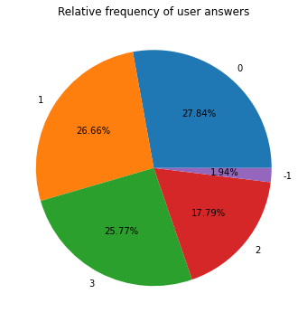
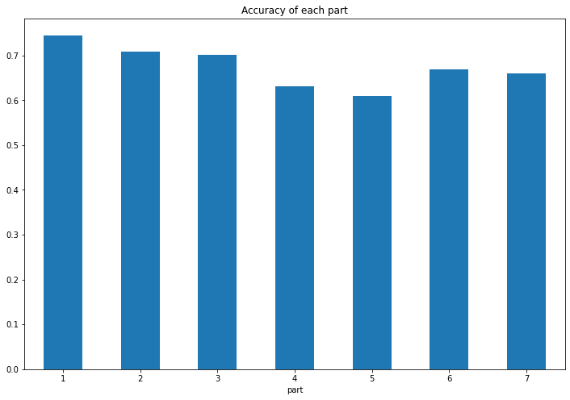
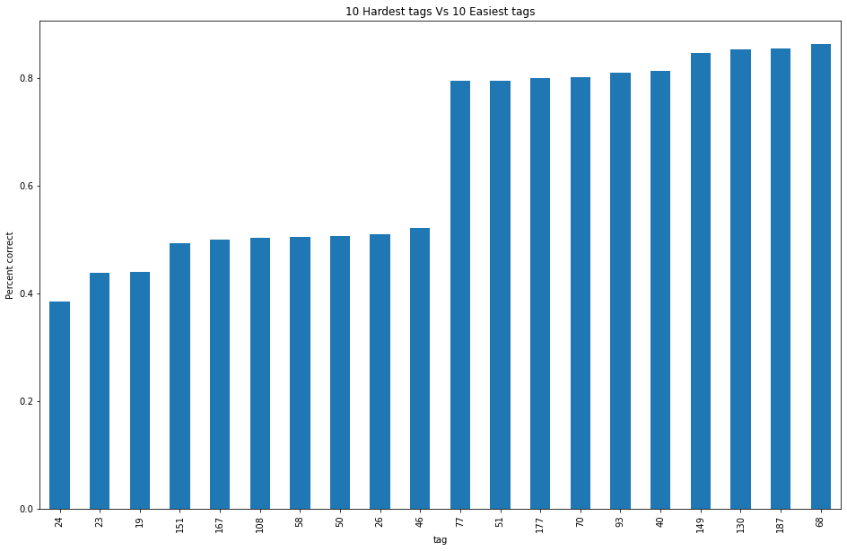

# Exploratory Data Analysis

Brief description of features in **train.csv**

- row_id: ID code for the row.
- timestamp: the time in milliseconds between this user interaction and the first event completion from that user.
- user_id: ID code for the user.
- content_id: ID code for the user interaction
- content_type_id: 0 if the event was a question being posed to the user, 1 if the event was the user watching a lecture.
- task_container_id: Id code for the batch of questions or lectures. For example, a user might see three questions in a row before seeing the explanations for any of them. Those three would all share a task_container_id.
- user_answer: the user's answer to the question, if any. Read -1 as null, for lectures.
- answered_correctly: if the user responded correctly. Read -1 as null, for lectures.
- prior_question_elapsed_time: The average time in milliseconds it took a user to answer each question in the previous question bundle, ignoring any lectures in between. Is null for a user's first question bundle or lecture. Note that the time is the average time a user took to solve each question in the previous bundle.
- prior_question_had_explanation: Whether or not the user saw an explanation and the correct response(s) after answering the previous question bundle, ignoring any lectures in between. The value is shared across a single question bundle, and is null for a user's first question bundle or lecture. Typically the first several questions a user sees were part of an onboarding diagnostic test where they did not get any feedback.

Brief description about nature of questions posed to students in **questions.csv**
- question_id: foreign key for the train/test content_id column, when the content type is question (0).
- bundle_id: code for which questions are served together.
- correct_answer: the answer to the question. Can be compared with the train user_answer column to check if the user was right.
- part: the relevant section of the TOEIC test.
- tags: one or more detailed tag codes for the question. The meaning of the tags will not be provided, but these codes are sufficient for clustering the questions together.

Brief description about type of lectures in **lectures.csv**
- lecture_id: foreign key for the train/test content_id column, when the content type is lecture (1).
- part: top level category code for the lecture.
- tag: one tag codes for the lecture. The meaning of the tags will not be provided, but these codes are sufficient for clustering the lectures together.
- type_of: brief description of the core purpose of the lecture

Some observations about the data

  

  

I have performed EDA on Riiid's EdNet data in the jupyter notebook Riiid EDA.ipynb

